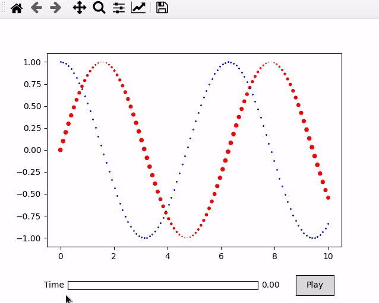

[](https://animatplot-ng.readthedocs.io/en/latest/?badge=latest)

# animatplot-ng
A python package for making interactive as well as animated plots with matplotlib. Based on [animatplot by r-makaro](https://github.com/t-makaro/animatplot).




## Requires
- Python >= 3.5
- Matplotlib >= 2.2 (because [sliders have discrete values](https://matplotlib.org/users/whats_new.html#slider-ui-widget-can-snap-to-discrete-values))
## Installation
```bash
pip install animatplot-ng
```

## Documentation
Documentation can be found [here](https://animatplot-ng.readthedocs.io/en/latest/index.html)

## Dev Install
```bash
git clone https://github.com/boutproject/animatplot-ng.git
pip install -e .
```
This project uses ```pycodestyle``` for linting. For testing, ```pytest``` is used.
